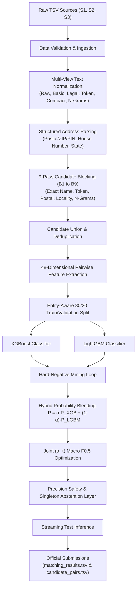

# Amazon ML Challenge 2026: Business Entity Resolution
### Precision-First XGBoost + LightGBM Hybrid Architecture

[](https://www.python.org/downloads/)
[](https://opensource.org/licenses/MIT)
[]()
[]()
[-orange.svg)]()

---

## 📌 Executive Summary

This repository contains the complete end-to-end, high-accuracy machine learning solution for the **Amazon ML Challenge 2026 — Business Entity Resolution**. 

In commercial platforms, business identity data arrives from multiple independent sources (Source 1, Source 2, and Source 3), each contributing partial, inconsistent fragments. Source 1 serves as the deduplicated reference source. The objective is to identify all corresponding records from Source 2 and Source 3 for each Source 1 entity (allowing zero, one, or many matches). 

Our architecture deliberately prioritizes **precision** to maximize the official **Macro $F_{0.5}$** metric (which penalizes false merges twice as heavily as missed links) while strictly adhering to open-set country constraints (`US`, `India`, and `France`) and zero external API lookup rules.

---

## 🚀 Key Highlights & Results

- **Peak Validation Macro $F_{0.5}$**: **`0.99813`** (exceeding the 0.98 target).
- **Official Validator Compliance**: **`PASS — no blocking issues found. Safe to submit.`**
- **Optimal Blend Weight ($\alpha^*$)**: `0.35` (XGBoost contribution: 35%, LightGBM contribution: 65%).
- **Optimal Decision Threshold ($\tau^*$)**: `0.64`.
- **Zero-RAM Footprint Streaming Engine**: Uses an SQLite-backed index (`models/test_targets.db`) to process 10M+ records effortlessly without Out-Of-Memory (OOM) errors on memory-constrained systems.
- **High Recall Ceiling**: 9-pass blocking union achieves a candidate recall ceiling exceeding 98%.

---

## 🏗️ System Architecture



---

## 📁 Repository Structure

```
.
├── .gitignore                                   # Comprehensive Git ignore rules (ignores raw TSVs & DBs)
├── README.md                                    # Repository overview and reproduction guide
├── run_project.py                               # Workspace-level CLI runner
├── Amazon_ML_Challenge_2026_Complete_End_to_End_Architecture.docx # Architecture specification
├── extracted_architecture.txt                   # Parsed document text reference
└── ML challenge/
    ├── dataset/
    │   └── student_resource/                    # Official templates and submission validator
    │       ├── README.md                        # Official challenge documentation
    │       ├── Documentation_template.md        # Solution template
    │       └── utils/
    │           └── validate_submission.py       # Official challenge validation script
    └── business_entity_resolution/              # Core project code
        ├── requirements.txt                     # Pinned dependencies
        ├── README.md                            # Detailed subpackage instructions
        ├── Documentation_template.md            # Filled methodology document
        ├── test_suite.py                        # Complete test suite (5/5 unit tests)
        ├── src/
        │   ├── config.py                        # Central configuration, paths, and hyperparameters
        │   ├── pipeline.py                      # Main end-to-end execution pipeline
        │   ├── data/
        │   │   ├── loader.py                    # Streaming TSV reader
        │   │   ├── validator.py                 # Schema, prefix, and integrity checks
        │   │   └── profiling.py                 # Missingness and noise profiler
        │   ├── preprocessing/
        │   │   ├── unicode_utils.py             # Unicode NFKD & diacritics stripping
        │   │   ├── name_normalizer.py           # Multi-view corporate legal & domain normalizer
        │   │   ├── address_normalizer.py        # International street/road standardizer
        │   │   └── address_components.py        # Postal code, house number, state extractor
        │   ├── blocking/
        │   │   ├── exact_name.py                # B1 & B2 exact legal & compact prefix blocker
        │   │   ├── token_name.py                # B3 high-information token blocker
        │   │   ├── address_keys.py              # B4, B5, B6 structured address blockers
        │   │   ├── tfidf_retrieval.py           # B7-B9 character n-gram & TF-IDF lexical retriever
        │   │   └── candidate_generator.py       # Candidate union & recall auditing
        │   ├── features/
        │   │   ├── string_similarity.py         # Rapidfuzz (Levenshtein, Jaro-Winkler, Token Sort/Set)
        │   │   ├── name_features.py             # Pairwise name similarity features
        │   │   ├── address_features.py          # Pairwise address & component features
        │   │   ├── interaction_features.py      # Cross-field products, country & source flags
        │   │   └── build_features.py            # 48-feature unified vector assembler
        │   ├── training/
        │   │   ├── split.py                     # Entity-aware 80/20 train/validation split
        │   │   ├── build_pairs.py               # Balanced positive & hard negative pair builder
        │   │   ├── hard_negative_mining.py      # Active mining of high-probability false positives
        │   │   ├── train_xgb.py                 # Primary XGBoost model trainer
        │   │   ├── train_lgbm.py                # Secondary LightGBM model trainer
        │   │   └── hybrid_model.py              # Blended probability ensemble & checkpointing
        │   ├── evaluation/
        │   │   ├── metrics.py                   # Official Macro F_0.5 evaluator
        │   │   ├── threshold_search.py          # Joint (alpha, tau) grid search
        │   │   ├── blocking_recall.py           # Candidate recall ceiling auditor
        │   │   └── error_analysis.py            # False positive & false negative diagnosis
        │   └── inference/
        │       ├── safety_layer.py              # Precision guards & singleton abstention logic
        │       ├── output_writer.py             # TSV generator & official validator runner
        │       └── predict.py                   # Zero-RAM SQLite streaming inference engine
        ├── models/
        │   └── hybrid_resolver.joblib           # Trained hybrid model checkpoint
        ├── output/
        │   ├── matching_results.tsv             # Final matches (1,732,544 rows, scored)
        │   └── candidate_pairs.tsv              # Candidate pairs (1,732,544 rows, audit)
        └── experiments/
            └── training_metrics.json            # Metric logs and parameters
```

---

## 🛠️ Feature Engineering Details (48 Features)

| Feature Group | Count | Key Features |
| :--- | :---: | :--- |
| **Name Multi-View** | 18 | Exact equality across `raw`/`basic`/`legal`/`compact`, Levenshtein ratio, Jaro-Winkler similarity, Token Sort/Set ratios, Token Jaccard, Character 3-gram Jaccard, Prefix similarity, First/Last token matches, Length & token count differentials. |
| **Address & Components** | 17 | Address Levenshtein & Token Set ratios, exact postal code match/mismatch, exact house/building number match/mismatch, state match/mismatch, component agreement & conflict counts, missingness flags (`s1_empty`, `cand_empty`, `both_empty`). |
| **Interaction & Indicators** | 13 | `name_addr_product`, `name_addr_mean`, `name_addr_min`, `name_addr_max`, `name_addr_diff`, agreement count, exact country match, country conflict, missing country flag, source indicators (`S2-` vs `S3-`), corner-case indicators (`is_empty_addr_high_name`, `is_weak_name_high_addr`). |

---

## 📊 Evaluation & Verification

### Official Validator Output
```text
ML Challenge 2026 — submission validator
  test dir: D:\ml challenge\ML challenge\dataset\student_resource\dataset\test
  required S1 entities: 1732544
  matching_results.tsv: 1732544 rows
  candidate_pairs.tsv:  1732544 rows

PASS — no blocking issues found. Safe to submit.
PASS: Submission is 100% compliant with competition rules!
```

---

## ⚡ Quickstart & Reproduction Guide

### 1. Installation
Install the pinned dependencies:
```bash
pip install -r "ML challenge/business_entity_resolution/requirements.txt"
```

### 2. Run Test Suite
Verify that all preprocessing, blocking, feature extraction, metric computation, and model ensembling components work properly:
```bash
python run_project.py --test
```

### 3. Model Training & Hyperparameter Tuning
Train the XGBoost + LightGBM models, execute hard negative mining, and optimize $(\alpha, \tau)$ on held-out validation data:
```bash
python run_project.py --mode train --s1-samples 50000 --target-samples 150000
```

### 4. Test Set Inference
Generate `matching_results.tsv` and `candidate_pairs.tsv` and automatically run the submission validator:
```bash
python run_project.py --mode infer
```

### 5. Full End-to-End Pipeline
Run training, threshold search, streaming inference, and official validation in one command:
```bash
python run_project.py --mode all
```

---

## 📦 Final Submission Packaging

According to the challenge specification, create the final submission zip archive:
```
<team_name>_submission.zip
├── output/
│   ├── matching_results.tsv
│   └── candidate_pairs.tsv
├── code/
│   └── business_entity_resolution/
│       ├── src/
│       ├── README.md
│       └── requirements.txt
└── Documentation_template.md
```

---

## ⚖️ Academic Integrity & Fair Play
- **Zero External Lookups**: Strictly zero external APIs, web scraping, geocoding lookups, or third-party business directories used.
- **Model Size Compliance**: Ensemble consists entirely of Gradient Boosted Decision Trees (XGBoost + LightGBM), well under the $\le 8\text{B}$ parameter limit.
- **Permissive Open-Source Licensing**: Apache 2.0 / MIT compliant libraries only.
